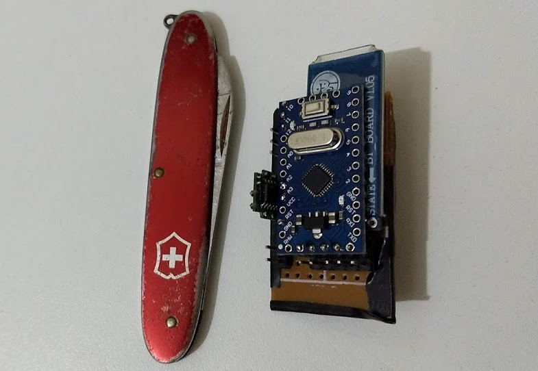
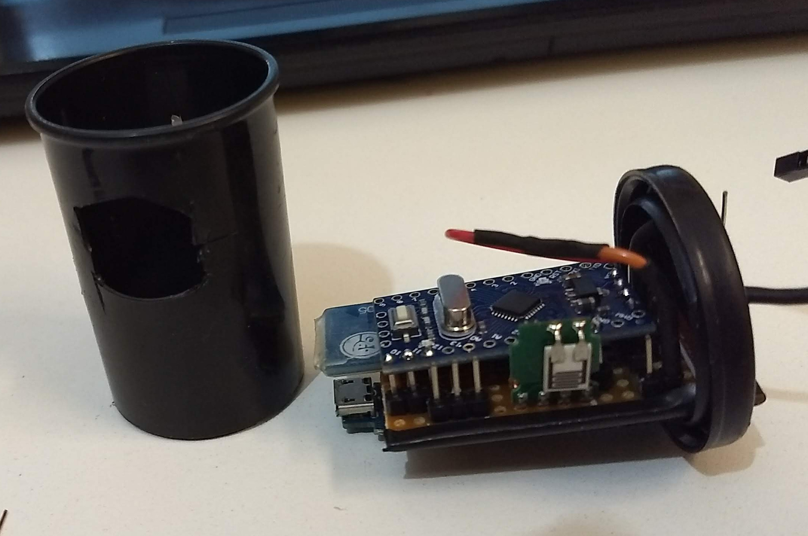
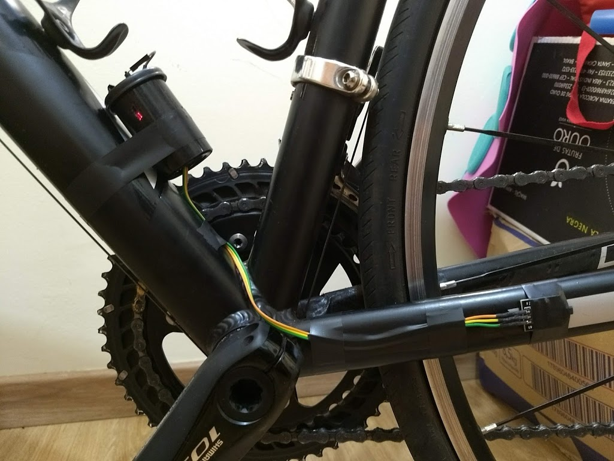

# Velocimetro Alerta Bluetooth Module

 .  . 

 .  .  

[EN] Project developed to realize a low cost cadence sensor. Using an Arduino Pro mini, bluetooth module and DHT temperature sensor.

[PT-BR] Projeto desenvolvido para realização de um sensor de cadência de baixo custo. Utilizando um Arduino Pro mini, modulo bluetooth e sensor de tempertatura DHT.

Can be integrated in the "Speedometer Alert" application
Pode ser integrado no aplicativo "Velocimetro Alerta"

- https://github.com/helpdeveloper/VelocimetroAlerta
- https://play.google.com/store/apps/details?id=br.com.helpdev.velocimetroalerta&hl=pt_BR

## Circuit

## Contributing

Pull requests are welcome. For major changes, please open an issue first to discuss what you would like to change.

Please make sure to update tests as appropriate.

## License

[Apache-2.0](https://choosealicense.com/licenses/apache-2.0/)
